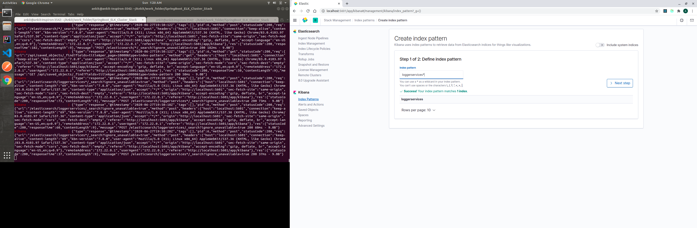
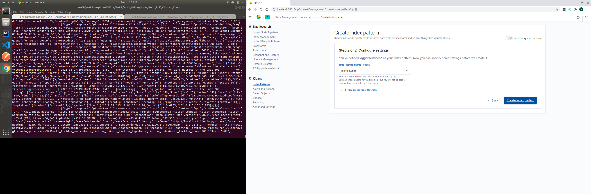
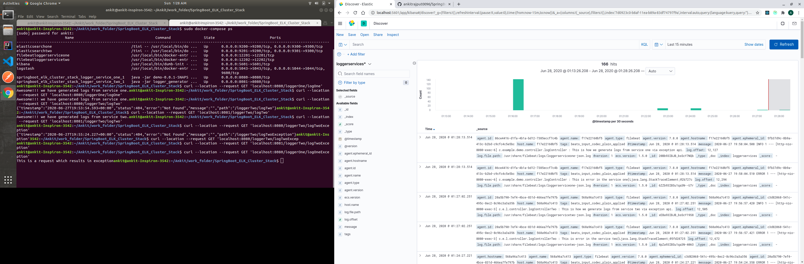

# SpringBoot_ELK_Cluster_Stack_With_Filebeat

This repository contains ELK (Elasticsearch, Logstash, Kibana) stack with two elasticsearch servers, one kibana server, one logstash server, two filebeat servers and
two spring boot servers which produce logs.

## Getting Started

These instructions will get you a copy of the project up and running on your local machine for development purposes. See running for notes on how to run the project on a system.

### Prerequisites

1. Clone the project to your local environment:
    ```
    git clone https://github.com/ankitrajput0096/SpringBoot_ELK_Cluster_Stack_With_Filebeat
    ```

2. You need Docker to be installed:

    #### Windows:
    https://download.docker.com/win/stable/Docker%20for%20Windows%20Installer.exe
    
    #### Mac:
    https://download.docker.com/mac/stable/Docker.dmg
    
    #### Ubuntu:
    https://docs.docker.com/install/linux/docker-ce/ubuntu/

## Installing and Running

To build the docker containers
```
docker-compose build
```
To start the docker containers
```
docker-compose up
```

## NOTE :
If there is an error that elasticsearch conntainer not run, may be because of "max virtual memory areas vm.max_map_count [65530] likely too low, increase to at least [262144]"

To fix it, run: 

`sudo sysctl -w vm.max_map_count=262144`


## All the exposed API's by spring-boot log-producer servers are as follows:

1. Curl command for spring-boot log-producer one server :- 
 * curl --location --request GET 'localhost:8080/loggerOne/logOne'
 * curl --location --request GET 'localhost:8080/loggerOne/logOneException'
2. Curl command for spring-boot log-producer two server :- 
 * curl --location --request GET 'localhost:8081/loggerTwo/logTwo'
 * curl --location --request GET 'localhost:8081/loggerTwo/logTwoException'
3. Try hitting these api's on terminal and Enjoy producing logs in the application !!

#### NOTE : To see elasticsearch cluster in action, observe terminal logs appropriately.

## Sample Screenshots

1. Creating index pattern for logger services


2. Discover Dashboard for Logger Services


## Curl Api's to manage elastic-search cluster
To go through all the curl api's for managing elastic-search cluster are present in folder `Elastic_Search_APIs_Management`

## Built With

* [Spring Boot](https://spring.io/projects/spring-boot) - Spring Boot 2
* [Maven](https://maven.apache.org/) - Dependency Management
* [Docker](https://www.docker.com/) - For containerization of application
* [ElasticSearch](https://www.elastic.co/) - For ElasticSearch servers
* [Kibana](https://www.elastic.co/kibana) - For ElasticSearch UI dashboard
* [Logstash](https://www.elastic.co/logstash) - For Logstash server to pipelining logs to elasticsearch servers
* [Filebeat](https://www.elastic.co/guide/en/beats/filebeat/current/filebeat-overview.html) - For Filebeat server to pipelining logs to logstash server

## Contributing

If you have any improvement suggestions please create a pull request and I'll review it.


## Authors

* **Ankit Rajput** - *Initial work* - [Github](https://github.com/ankitrajput0096)

## License

This project is licensed under the MIT License
